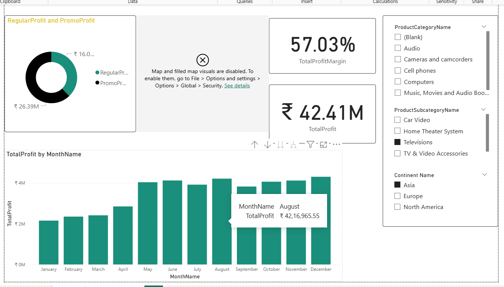
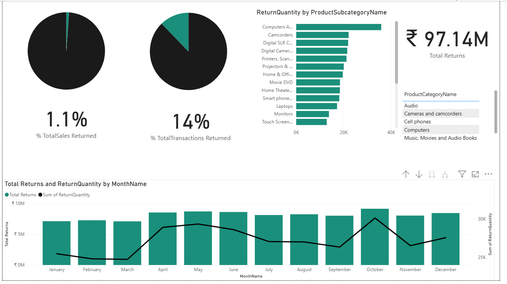

# 📊 Sales & Profitability Analysis Dashboard

An interactive Power BI dashboard analyzing sales performance, profitability trends, and return patterns across multiple product categories and global regions.

## 🔍 Dashboard Overview

### Page 1 — Profit Analysis



**Key Metrics:**
- **₹42.41M** Total Profit
- **57.03%** Total Profit Margin
- **Regular Profit:** ₹26.39M | **Promo Profit:** ₹16.0M

**Visualizations:**
- 🍩 Donut Chart — Regular vs. Promotional Profit split
- 📊 Bar Chart — Monthly profit trends (Jan–Dec)
- 🎛️ Slicers — Filter by Product Category, Subcategory, and Continent

---

### Page 2 — Returns & Refunds Analysis



**Key Metrics:**
- **₹97.14M** Total Returns
- **1.1%** Total Sales Returned
- **14%** Total Transactions Returned

**Visualizations:**
- 🥧 Pie Charts — % Sales Returned and % Transactions Returned
- 📊 Horizontal Bar Chart — Return Quantity by Product Subcategory (Computers Accessories lead)
- 📈 Combo Chart — Monthly Returns (₹) vs. Return Quantity trend with dual axis

---

## 🛠️ Tools & Technologies

| Tool | Purpose |
|------|---------|
| **Power BI Desktop** | Data modeling, visualization & report design |
| **DAX** | Calculated measures (Profit Margin, % Returns, etc.) |
| **Power Query (M)** | Data transformation & cleansing |

## 📁 Data Model

The dashboard is built on a **star schema** with the following tables:

```
FactSales (Fact Table)
├── Channel
├── Dates
├── Geography
├── Product
│   ├── ProductCategory
│   └── ProductSubcategory
├── Promotion
└── Stores
```

## 📌 Key Insights

1. **Profit peaks in summer months** (June–August), suggesting seasonal demand spikes
2. **Regular sales drive 62% of total profit** vs. 38% from promotional sales
3. **Computer Accessories** have the highest return quantity — potential quality or expectation mismatch
4. **Return rate is low at 1.1%** of total sales but affects **14% of transactions**, indicating frequent small-value returns
5. **October sees a dip in returns** while **April shows a spike** — possible post-sale seasonal pattern

## 🚀 How to Use

1. Download [`Revenue_Dashboard.pbix`](Revenue_Dashboard.pbix)
2. Open in [Power BI Desktop](https://powerbi.microsoft.com/desktop/) (free)
3. Use the slicers on the right to filter by:
   - Product Category (Audio, Cell phones, Computers, etc.)
   - Product Subcategory
   - Continent (Asia, Europe, North America)

## 👤 Author

**Samridhi Tyagi** — Data Analyst  
[LinkedIn](https://www.linkedin.com/in/samridhi-tyagi-300244267/) • [GitHub](https://github.com/samjkk)

---

> *Built with Power BI Desktop • Data sourced from multi-channel retail sales dataset*
